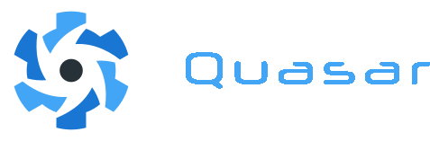

Quasar Framework with VueJs application web responsive and PWA that contains interface web, user registers and the application connected to a Laravel API <a href="https://laravelapijuegos.herokuapp.com/api/juegos" target="_blank"> https://laravelapijuegos.herokuapp.com</a>

Project Laravel Api Server: <a href="https://github.com/JAVI-CC/Laravel-API-Server" target="_blank">https://github.com/JAVI-CC/Laravel-API-Server</a>

<h2>Start the app in the development mode</h2>
<pre><code>$ npm install && quasar dev -m pwa</code></pre>

<h2>Start the app in the production mode</h2>
<pre><code>$ npm install && quasar build -m pwa</code></pre>

<h2>Demo</h2>
<a href="https://quasar-api-client.vercel.app/" target="_blank">https://quasar-api-client.vercel.app/</a> 
User: admin@email.com 
Password: 12345678

<h3>Show get all registries API SERVER:</h3>

<h3>Login form:</h3>

<h3>Create or update registrer sending it to the API SERVER:</h3>

<h3>Application web responsive:</h3>

<h2>Deploy to Docker <g-emoji class="g-emoji" alias="whale" fallback-src="https://github.githubassets.com/images/icons/emoji/unicode/1f433.png">🐳</g-emoji></h2>

<h4>Setup:</h4>
<pre>
<code>$ git clone https://github.com/JAVI-CC/Quasar-API-client.git
$ cd Quasar-API-client
$ docker-compose up -d --build</code>
</pre>

Once you have the containers deployed, you can access the API at  <a href="http://localhost:8080" target="_blank">http://localhost:8080</a>
